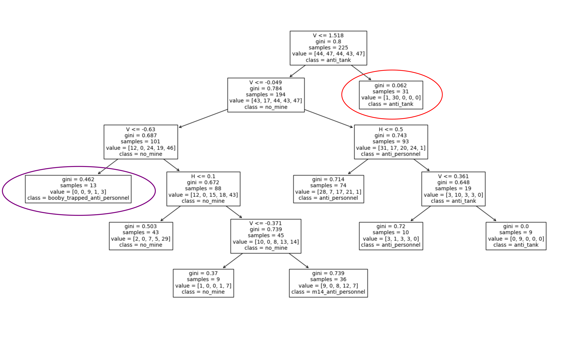
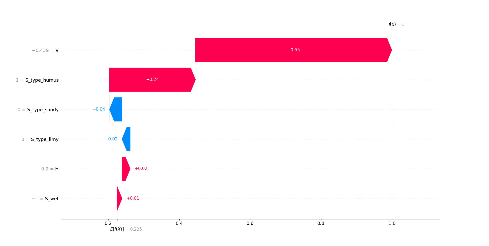
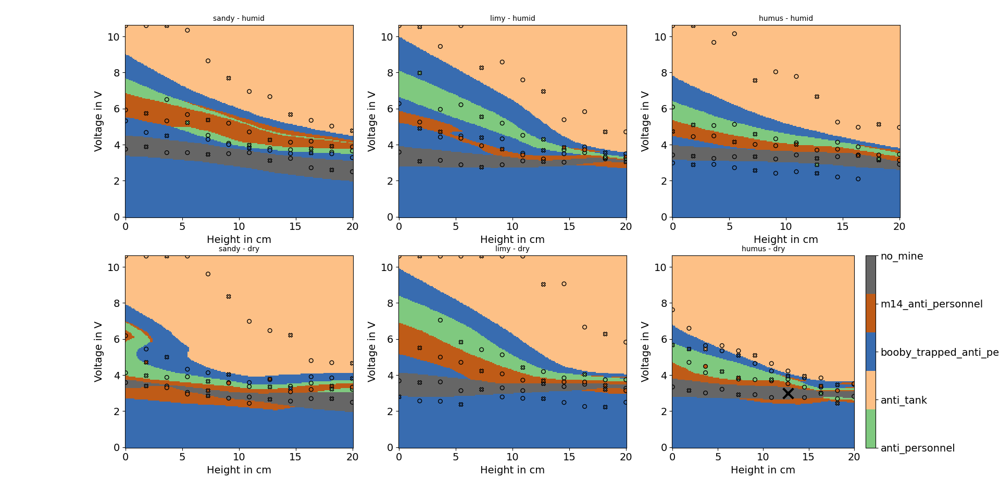
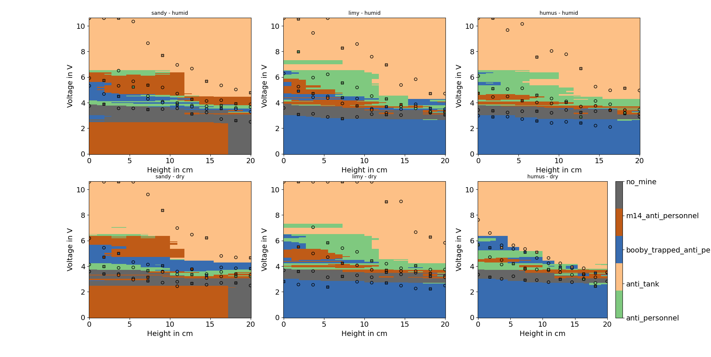

# Exploring the Land Mines Dataset

## Introduction
This is just an exercise in understanding Machine Learning (ML)-models trained on the "land mines" dataset
that can be found [here](https://archive.ics.uci.edu/dataset/763/land+mines-1). If you are
interested, I definitely recommend reading [[1]](#1), which is the publication belonging to this dataset.
What makes this dataset stand out is that it is quite low dimensional (each sample contains only 
three different features, one of which is categorical). This should make it easier for us to
understand what is going on when trying to classify the type of land mine a measurement belongs to.

## Installation / Following along
If you want to follow along (or play with the code), simply
1. Use git to clone this repo.
2. Install the requirements.txt running `pip install -r requirements.txt` in the root folder of the repo.
3. Download the `Mine_Dataset.xls` hosted at [[2]](#2) and place it in the folder `MinceClassification/data/`.
4. Run the different scripts in the `mine_classification` folder as they are mentioned in the text.

## Initial data exploration
Before doing anything, it makes sense to first get familiar with the dataset. Each measurement in the dataset
contains three features, the measured voltage (V), the distance between the measurement device and the
soil (H) and the soil type (S). The soil type is one of "dry-and-sandy", "dry-and-humus", "dry-and_limy",
"humid-and-sandy", "humid-and-humus" and "humid-and-limy". Because I felt like this variable is encoding two
features at once, I decided to split this feature into soil wetness (S_wet: dry/humid) and actual soil type
(S_type: sandy/humus/limy).

The label for each measurement, i.e. what we want to predict, is the type
of land mine that was buried beneath the soil in the experiment. The different mine types are
"anti-tank", "anti-personnel","booby-trapped anti-personnel", "M14 anti-personnel" and "no mine". 

Plotting a scatter-matrix of the entire dataset ([fig. 1](#dataset_overview)), we can see that some
mine types are pretty easy to discern without doing any machine learning at all. In particular,
measurements with a very high voltage value are "anti-tank" mines (red ellipsis), while 
measurements with a very low voltage are "booby-trapped anti-personnel" mines (purple ellipsis).
For other voltage values, the correct mine classification is not as trivial though. 
We can also discern that the measured voltage tends to increase with decreasing height/distance from the soil,
which seems sensible even with a rather limited knowledge of the inner workings of the measurement process.
Additionally, it seems like the data distribution does not change drastically when altering 
soil type or soil wetness. We can therefore speculate that these two features are probably
not going to be our most important ones, whereas height and voltage do seem quite important when
determining the mine type.

If you want to try out an interactive version of [fig. 1](#dataset_overview), you can run the 
`test_load_mine_data` test in `tests/test_data_preparation.py`, setting `do_plot = True`.

<figure id="dataset_overview">
  
  <figcaption>
        Figure 1: Scatter matrix plot of land mines datasets. The purple and red ellipse point out two types of
        land mines ("anti-tank" and "booby-trapped anti-personnel") that one can identify manually simply by
        looking at the data.
  </figcaption>
</figure>

## Fitting some models
To try and automatically classify the mine from a measurement, we first split our data into a training
set and a test set. Looking at the `Mine_Dataset.xls` file, there is point at about 2/3 of the dataset
where the labels are cycled through a second time. We use this point to split the data into 2/3 training 
data and 1/3 test data (I know that one usually does this split randomly, and we will come back to this). 

We will try fitting four different models, a decision tree, a random forest and a MultiLayer Perceptron (MLP)
from the Scikit-learn library [[3]](#3) and an Explainable Boosting Machine (EBM) from the
Interpret library [[4]](#4). This selection is rather just my preference for what I wanted to try
(and you can add other models in the `MineClassification/mine_classification/train_model.py` script if you like). 
However, there are two models here that should be inherently interpretable, the decision tree (provided
one does not allow too many splits) and the EBM. In particular, EBMs allegedly [[5]](#5) perform as good as
random forests while being as interpretable as decision lists.
The other two models are more of a black box, and, for the MLP in particular, how the model decides when giving
a prediction is unclear.

To fit the models, run the `train_model.py` script. Notice that I wrapped the EBM classifier in a 
`OneVsRestClassifier` from Scikit-learn, as I had some problems when taking interactions into account
in our multi-class classification problem. So instead, the script now essentially fits an EBM classifier for
every type of land mine (using the `OneVsRestClassifier` class from Scikit-learn).
Running the script, I get (your results might differ slightly to the randomized hyperparameter search in the
`train_model.py` script):

|           Classifier          | acc_CV | acc_stdv_CV | acc_test |
|-------------------------------|--------|-------------|----------|
|     DecisionTreeClassifier    | 0.498  |    0.052    |  0.513   |
| ExplainableBoostingClassifier | 0.538  |    0.051    |  0.602   |
|     RandomForestClassifier    | 0.547  |    0.090    |  0.655   |
|         MLPClassifier         | 0.716  |    0.038    |  0.770   |
<p align="center" style="max-width: 500px">
<a id="tab_1">Table 1</a>: Accuracy of different classification models during 5-fold cross-validation on the
training data (acc_CV) and on the test data (acc_test). The column "acc_stdv_CV" shows the standard deviation
during the 5-fold cross-validation on the training data.
</p>

As we can see, our MLPClassifier achieves 77.0% accuracy on the test data. This beats the 71.3% accuracy
of the Artificial Neural Network (ANN) in [[1]](#1), but is lower than the 85.8% accuracy 
that the authors of [[1]](#1) obtain with their heuristic, fuzzy metric k-NN model.
However, we are not really interested in the getting the highest number here.
Instead, [table 1](#tab_1) poses two observations that are a lot more intriguing:
1. The accuracy obtained via cross-validation appears to be noticeably worse than
   what we get on the never-before seen test data for all models. This seems to be consistent
   through multiple runs of the `train_model.py` script, which indicates that this
   is not just due to chance. Naively, one would expect the performance on unknown data
   to be equal or worse to what is observed during cross-validation, not better. As far
   as I can tell, this is caused by the test data selection, meaning that the effect 
   disappears if we select the test data randomly from the original data (set
   `random_train_test_split` to `True` in the `params.py`-file to try this for yourself).
2. The MLPClassifier performs substantially better than the other three model types.
   In [table 1](#tab_1), its cross-validation accuracy is 16.9% (!) better than what we observe for
   the next best model. Considering that we really want to use an inherently interpretable model,
   the burning question is what the (uninterpretable) MLPClassifier is doing to achieve
   results that are so superior.

In the following, we will take a close look at how far we can interpret our models, searching
for an answer to question two (among other things).

## Analyzing the models
In the following, we will try to find out how the different models 'tick'. To try doing the
plots for yourself, you can use the `MineClassification/mine_classification/explain_model.py`
script. Simply insert the path of the models pickle-file for the `model_file` variable and
run the script.

### Decision Tree
While the performance of the decision tree is rather poor, it has the advantage
of being interpretable. In fact, we can graphically depict the whole model as shown in fig. [2](#decision-tree).

<figure id="decision_tree">
  
  <figcaption>
      Figure 1: Decision tree fitted to the land mines dataset. The red and purple ellipses point out
      the classification for the highest and lowest voltage values, respectively. Note that the voltages (V)
      and heights (H) given at the split points have been normalized with a `RobustScaler` and are therefore
      not in terms of Volt/Meter.
  </figcaption>
</figure>

Notice that parts of the model act like we initially assumed, i.e. samples with high voltage are 
predicted as "anti-tank" (red ellipsis), while samples with low voltage are predicted as
"booby-trapped anti-personnel" (purple ellipsis). Voltages in between are treated a bit more subtly, taking into account
the height value of the sample.
Here, a big advantage of interpretable models becomes apparent: We can see that the soil type does
not matter at all to this decision tree. While this does of course not tell us whether the soil
type actually matters with certainty, we can say for sure that this model completely disregards it.

### Explainable Boosting Classifier
On the land mines data, the performance of the EBM is also not all that great. I think this is due to
the dataset though, as the random forest is not noticeably better - so the claim from [[5]](#5) that
it performs as good as a random forest holds, even though it is clearly beaten by the MLP.
Unfortunately, I could not quite manage to interpret the EBM-model, even though EBMs are claimed to be
highly interpretable. While I did find that [[4]](#4) offers a way to get a global explanation for the
model
```
from interpret import show

ebm_global = ebm.explain_global()
show(ebm_global)
```
the `show` function did not work for me. This would have produced an overview of feature importance, which
is definitely helpful, but far from what I would consider a complete model interpretation.

### MLP
Since both the MLP and the random forest are black box models, we have to use special techniques to gain insight 
into what they are doing. One way to do this is to use Shapley values [[6]](#6), which can give an explanation
for the importance of different features for an individual prediction and for the model as a whole. 

Another way that is open to us in this special case is to simply brute-force plot the complete decision space
of the model. While this technique is only useful on datasets with a sufficiently low number of relevant 
features, it is immensely helpful in understanding model behavior.

#### Shapley Values
For a good explanation of how Shapley values are calculated, see these videos [[7]](#7), [[8]](#8).
Essentially, Shapley values determine the contribution of a feature value to a specific prediction
by comparing the predicted result to a hypothetical scenarios where the feature value is not part
of the prediction.

As you may already be able to tell by the explanation, Shapley values provide an explanation for
a specific sample only (i.e. a local explanation). For example, [fig. 2](#shap_local) shows the
Shapley values for a single sample from the test data that is predicted as "no_mine" by the MLP.
<figure id="shap_local">
  
  <figcaption>
      Figure 2: Shapley values for a sample predicted as "no_mine" by the MLP.
  </figcaption>
</figure>

Knowing that this specific sample is predicted to not be a land mine mainly because of the
soil and the low measured voltage can be helpful. It does, however, not really help us to understand
the model as a whole. While one can get some global feature importance via Shapley values (
run `MineClassification/mine_classification/explain_model.py` to see the corresponding plot),
this also does not quite tell us why the MLP is performing so much better than the three other
models.

#### Brute force plotting
[Fig. 3](#decision_space_mlp) shows how the MLP classifier makes predictions depending on voltage and height given 
each combination of the categorical variables soil type and soil wetness. We can immediately see that coming up with
an equivalent model that is completely interpretable is non-trivial, as the behavior seen would be very difficult to
reproduce with something like a decision tree. 

<figure id="decision_space_mlp">
  
  <figcaption>
      Figure 3: Decision space for the MLP classifier. Each plot shows the voltage - height behavior for 
      a combination of the two categorical variables (e.g. soil type "sandy" and wetness "humid" for
      the upper left plot). The filled circles and crosses mark the training and test samples, respectively,
      where the fill color corresponds to the actual mine type of the sample. The solid black cross marks
      the point whose Shapley values are shown in fig. 2.
  </figcaption>
</figure>

In fact, the voltages that separate the different land mine types seem to decay somewhat exponentially with larger
heights, which could be very interesting for a domain expert. Additionally, we can see that the different soil
types do indeed play a role in the prediction. Note though that the model seems rather overfit in places.
For example, I very much doubt that what we see in the lower left plot of [fig.3](#decision_space_mlp) is
physically correct behavior. 

It is also quite striking that, for low voltages, the MLP tends to classify any sample as a 
"booby-trapped anti-personnel" mine. While this might be okay, a domain expert could conclude that this
is erroneous behavior. At least naively, one would not expect there to be a mine if no voltage is 
measured at all. [Fig. 4](#decision_space_random_forest) shows a similar decision space plot for the random forest.

<figure id="decision_space_random_forest">
  
  <figcaption>
      Figure 4: Decision space for the random forest classifier. Each plot shows the voltage - height behavior for 
      a combination of the two categorical variables (e.g. soil type "sandy" and wetness "humid" for
      the upper left plot). The filled circles and crosses mark the training and test samples, respectively,
      where the fill color corresponds to the actual mine type of the sample. 
  </figcaption>
</figure>

Looking at [fig. 4](#decision_space_random_forest), we can finally venture an educated guess about why the
MLP outperforms the other three, tree based models in this case. Since decision trees are only capable
of drawing straight decision lines in the voltage vs. height space, they have difficulties in capturing the
continuous change of the true decision boundaries that separate the different types of land mines.
Therefore, it is not surprising that the MLP, which does not have this inherent bias, outperforms them
on this dataset.

## Conclusion
As we can see in this example, understanding how a model behaves can be very helpful, both to 
drive understanding of the underlying problem and to preempt unexpected behavior in the field.
Also, there are problems where interpretable models consisting only of simple rules 
(e.g. voltage > 5V and height < 10cm) will struggle to describe what is actually going on.
Finally, if the amount of (relevant) features is low enough, plotting the entire decision
space of your model is generally a very good idea. 

## References
<a id="1">[1]</a> 
C. Yilmaz, H. T. Kahraman and S. Söyler, "Passive Mine Detection and Classification Method
Based on Hybrid Model" IEEE Access, 2018, [URL](https://ieeexplore.ieee.org/ielx7/6287639/8274985/08443331.pdf?tp=&arnumber=8443331&isnumber=8274985&ref=),
DOI: 10.1109/ACCESS.2018.2866538

<a id="2">[2]</a>
M. Kelly, R. Longjohn and K. Nottingham, "The UCI Machine Learning Repository", [Land Mines Dataset](https://archive.ics.uci.edu/dataset/763/land+mines-1)

<a id="3">[3]</a>
F. Pedregosa, G. Varoquaux, A. Gramfort, V. Michel, B. Thirion, O. Grisel, M. Blondel, P. Prettenhofer, R. Weiss,
V. Dubourg, J. Vanderplas, A. Passos, D. Cournapeau, M. Brucher, M. Perrot and E. Duchesnay,
"Scikit-learn: Machine Learning in Python" Journal of Machine Learning Research, 2011, 
[Article](https://dl.acm.org/doi/10.5555/1953048.2078195), [Website](https://scikit-learn.org/stable/index.html)

<a id="4">[4]</a>
Nori, Harsha, Jenkins, Samuel, Koch, Paul, Caruana, Rich, "InterpretML: A Unified Framework for
Machine Learning Interpretability" arXiv preprint, 2019, [Article](https://arxiv.org/abs/1909.09223),
[Website](https://github.com/interpretml/interpret)

<a id="5">[5]</a>
Microsoft Research, "The Science Behind InterpretML: Explainable Boosting Machine" youtube, 2020, [URL](https://www.youtube.com/watch?v=MREiHgHgl0k)

<a id="6">[6]</a>
S. M. Lundberg, S. Lee, "A Unified Approach to Interpreting Model Predictions" 31st Conference on Neural
Information Processing Systems, 2017, [URL](https://arxiv.org/abs/1705.07874)

<a id="7">[7]</a>
A Data Odyssey, "The mathematics behind Shapley Values" youtube, 2023, [URL](https://www.youtube.com/watch?v=UJeu29wq7d0)

<a id="8">[8]</a>
A Data Odyssey, "Shapley Values for Machine Learning" youtube, 2023, [URL](https://www.youtube.com/watch?v=b9qqbFudVhI)

